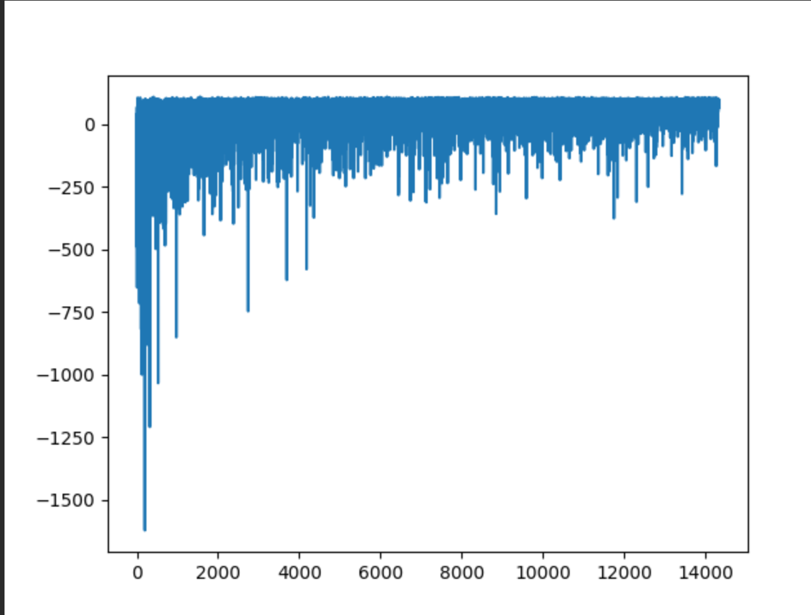
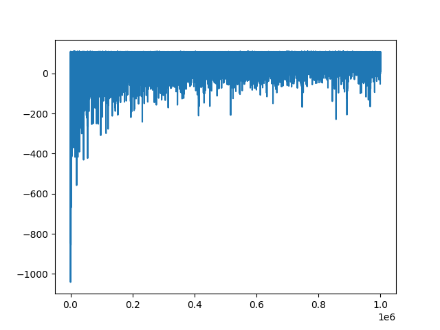

# Dofus AI Qtable

Au bout de 15 000 itérations :

Au bout de 1 000 000 d'itérations:

Les scripts à exécuter :
 - train_no_window.py   -> permet d'entrainer l'Agent sans interface graphique -> optimiser niveau temps d'entrainement
 - train_with_window.py -> permet d'entrainer l'Agent avec une interface graphique -> non optimiser niveau temps d'entrainement mais permet de visualiser les comment l'agent s'entraine
 - play_dofus.py        -> permet de faire jouer l'Agent sur le vrai jeu
 - play_fake_dofus.py   -> permet de faire jouer l'Agent sur une simulation du jeu

